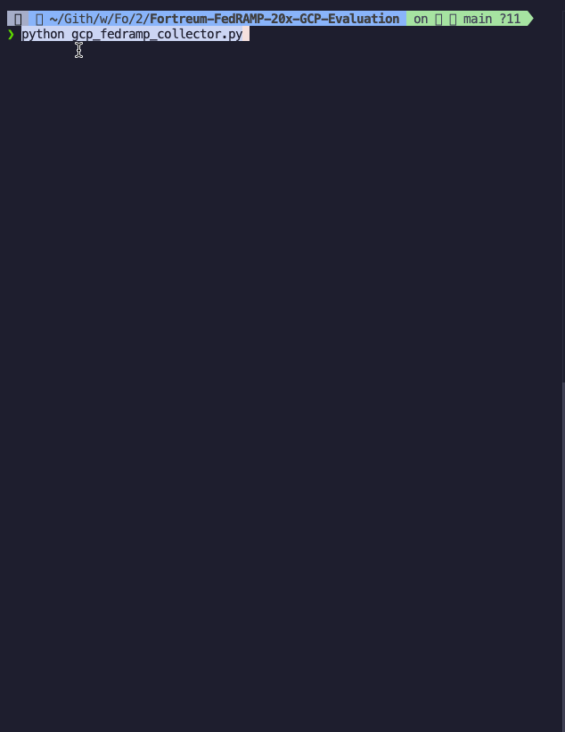

# FedRAMP 20x GCP Collector & Analyzer

A read-only GCP collector and analyzer from my BSides Orlando 2025 talk. It pulls cloud configuration and checks it against a FedRAMP 20x pilot-era KSI snapshot.

This was demoed at **BSides Orlando 2025** during the talk *GRC Engineering in the Cloud*. The slides are in the repo root: [`../GRC-Engineering-in-the-Cloud.pdf`](../GRC-Engineering-in-the-Cloud.pdf).



## Important context

This is a demo artifact from the FedRAMP 20x pilot period, not current FedRAMP guidance. I wrote it around **September 26, 2025**, against the public pilot material available then.

FedRAMP's public docs continued changing after that date. There is no exact September 26 commit in the visible [`FedRAMP/docs`](https://github.com/FedRAMP/docs) history; the useful surrounding anchors are the September 11, 2025 pilot/VDR regeneration commit [`34a080e`](https://github.com/FedRAMP/docs/commit/34a080e), the October 7, 2025 impact-level/generator update [`ff2a9b3`](https://github.com/FedRAMP/docs/commit/ff2a9b3), and the November 5, 2025 Phase Two KSI draft commit [`b79d0a9`](https://github.com/FedRAMP/docs/commit/b79d0a9).

Use this as a starting point, not a current compliance answer key. If you want to use it for real FedRAMP work, check the KSI mappings, scoring, and finding text against the current FedRAMP 20x material first.

## How I used it

I used this pattern in two ways:

1. **Auditor / 3PAO.** Run it against a customer's GCP project, or have the customer run it in Cloud Shell. Get the archive. Analyze it offline against the KSIs. The code is readable, so the audit trail is not just *"the dashboard said so."*
2. **Internal GRC engineering.** Put the same logic in Cloud Run or Cloud Functions. Run it on a schedule. Write the results to a bucket. Hand the same output to your auditor instead of rebuilding the evidence package once a year.

Both shapes are GRC engineering. The code works for both.

## What it does

- Collects configuration data from **20+ GCP services** with the Google Cloud Python SDK
- Maps findings to a historical FedRAMP 20x pilot-era KSI set (IAM, CNA, MLA, SVC, PIY, RPL, CMT)
- Generates JSON or HTML reports with findings and suggested fixes
- **Read-only.** No writes. No workload data. No key material. Encryption checks use metadata only: CMEK vs. Google-managed.

## Quick start

### Option A: Local

```bash
python3 -m venv venv
source venv/bin/activate
pip install -r requirements.txt

gcloud auth application-default login
gcloud config set project YOUR_PROJECT_ID

python3 gcp_fedramp20x_collector.py --project YOUR_PROJECT_ID
python3 -m analyzer.fedramp_analyzer fedramp_gcp_collection_*.tar.gz -f html -o report.html
```

### Option B: Google Cloud Shell

Cloud Shell already has auth wired up:

```bash
pip install -r requirements.txt
python3 gcp_fedramp20x_collector.py --project YOUR_PROJECT_ID
```

When the collector finishes, download the `fedramp_gcp_collection_*.tar.gz` archive from the Cloud Shell menu.

### Option C: Service account

For scheduled runs, like the serverless-function version from the talk:

```bash
export GOOGLE_APPLICATION_CREDENTIALS="/path/to/key.json"
python3 gcp_fedramp20x_collector.py --project YOUR_PROJECT_ID
```

See [`SERVICE_ACCOUNT_SETUP.md`](SERVICE_ACCOUNT_SETUP.md) for the IAM bindings.

## Multi-project collection

For multiple projects:

```bash
# Comma-separated list
python3 gcp_fedramp20x_collector_multi.py --projects proj1,proj2,proj3

# Or from a file (see projects.csv.example / projects.json.example)
python3 gcp_fedramp20x_collector_multi.py --project-file my_projects.csv

# Parallel (max 3 concurrent by default)
python3 gcp_fedramp20x_collector_multi.py --project-file projects.csv --parallel
```

Output layout:

```
fedramp_multi_collection_YYYYMMDD_HHMMSS/
├── project1_fedramp_collection_*.tar.gz
├── project2_fedramp_collection_*.tar.gz
├── collection_summary.txt
└── collection_results.json
```

## Required permissions

The collector is read-only. Easiest option is the two built-in roles:

- `roles/viewer`
- `roles/iam.securityReviewer`

If you need a tighter custom role, the full permission list lives in [`GCP_PERMISSIONS_REFERENCE.md`](GCP_PERMISSIONS_REFERENCE.md).

## Analyzer

```bash
# JSON (default)
python3 -m analyzer.fedramp_analyzer fedramp_gcp_collection_*.tar.gz

# HTML
python3 -m analyzer.fedramp_analyzer fedramp_gcp_collection_*.tar.gz -f html -o report.html

# Executive-summary flavor
python3 -m analyzer.report_generator_simple fedramp_gcp_collection_*.tar.gz
```

The analyzer reads a single-project archive or an extracted collection directory. For multi-project runs, analyze the per-project archives in the multi-project output directory.

## Testing

The analyzer tests use fake collector output, so they do not need GCP credentials:

```bash
python3 -m unittest discover -s tests
```

### KSI coverage

| KSI    | Area                                      |
|--------|-------------------------------------------|
| KSI-IAM | Identity and Access Management            |
| KSI-CNA | Cloud Native Architecture                 |
| KSI-MLA | Monitoring, Logging, and Auditing         |
| KSI-SVC | Service Configuration & Encryption        |
| KSI-PIY | Policy and Inventory                      |
| KSI-RPL | Recovery Planning                         |
| KSI-CMT | Change Management                         |

### What it flags

Typical findings the analyzer surfaces:

- Primitive IAM roles (`roles/owner`, `roles/editor`)
- Public buckets / open firewall rules
- Missing or default-managed encryption where CMEK is expected
- Disabled audit logging or missing log sinks
- Missing backup / DR configuration
- Outdated GKE / Compute images
- Org-policy gaps (Access Approval, Essential Contacts, VPC Service Controls)

## Data collected

**Configuration only.** Never key material, secrets, or workload data.

- IAM policies, custom roles, service accounts
- VPCs, firewalls, routes, subnets, NEGs, Service Attachments
- Compute (instances, disks, images, snapshots)
- Storage buckets and their encryption settings
- Cloud SQL, Spanner, Bigtable, Memorystore, Firestore
- BigQuery, Dataflow, Dataproc, Pub/Sub, Composer
- Vertex AI models / endpoints, AI Notebooks
- GKE clusters (with encryption details), Artifact Registry, Binary Authorization
- Cloud Functions, Cloud Run, App Engine
- Cloud Build (builds + triggers), Deployment Manager
- Logging sinks, monitoring policies, dashboards, uptime checks
- Backup & DR plans/vaults, snapshot policies
- Org-level: Access Approval, Essential Contacts, Organization Policies

## Shell-only alternatives

If you don't want to run Python, there are shell versions:

- `fedramp_evidence_gcloud_oneliners.sh`: full evidence collection with gcloud
- `fedramp_evidence_oneliners.sh`: generic oneliner reference
- `bucket_encryption_oneliner.sh`: focused bucket-encryption check

## Architecture notes

- `concurrent.futures` for parallel API calls. Much faster than sequential `gcloud` loops.
- Retry with backoff for API quota / rate-limit errors
- Skips Binary Authorization API by default (it can hang on unauthenticated calls); pass `--include-binauthz` to opt in
- Per-service errors are captured in `collection_results.json` instead of killing the whole run

## Extending

To add a new KSI check:

1. Add the collection logic to `gcp_fedramp20x_collector.py` (look for the existing per-service collectors as a template)
2. Add the analyzer logic to `analyzer/fedramp_analyzer.py`
3. Update the KSI mapping where appropriate

## Troubleshooting

- **`command not found: python`**: use `python3`; the tool requires Python 3.7+
- **Permission denied.** Confirm `roles/viewer` + `roles/iam.securityReviewer`, and make sure the relevant API is enabled on the project.
- **Script appears to hang.** Binary Authorization is the usual suspect; it's skipped by default. Ctrl-C is safe. Partial archives still analyze.
- **Archive >100 MB.** Large orgs hit this. Transfer via GCS rather than email.

## Security

- Don't commit GCP credentials or service-account keys (`.gitignore` covers the usual suspects)
- Treat collection archives as sensitive. They describe your environment, even if they don't contain secrets.
- Always transfer archives over an authenticated channel
